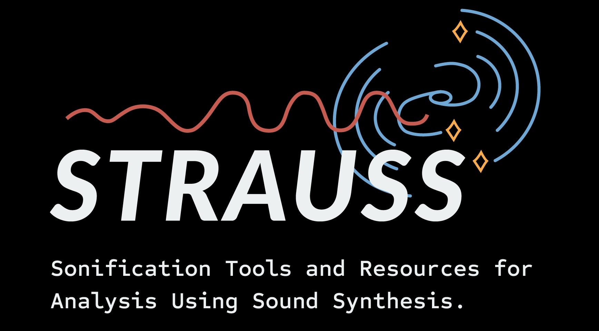

# STRAUSS
***S**onification **T**ools and **R**esources for **A**nalysis **U**sing **S**ound **S**ynthesis*



## Sonification and STRAUSS

*"Sonification"* is the process of conveying data via the medium of sound. Sonification can be used to make scientific data more accessible to those with visual impairments, enhance visualisations and movies, and even convey information more efficiently than by visual means. The *STRAUSS* python package is intended to make sonification simple for both scientific and outreach applications.

## Getting Started

Access the [full documentation here](https://strauss.readthedocs.io/) and read more about the associated [Audio Universe project here](https://www.audiouniverse.org/).

*STRAUSS* is  [PyPI hosted package](https://pypi.org/project/strauss/) and `pip` can be used for the default installation:

`pip install 'strauss[default]'`

For a standard install (without text-to speech support).

For development purposes, you can instead use:

`pip install -e .`

where the `-e` option allows a local install, such that you can modify and run the source code on the fly without needing to reinstall each time. 

If you would like access to all the resources and explore the code directly, make a copy of the *STRAUSS* repository via SSH,

`git clone git@github.com:james-trayford/strauss.git strauss`

or HTTPS if you don't have [SSH keys set up](https://docs.github.com/en/github/authenticating-to-github/connecting-to-github-with-ssh),

`git clone https://github.com/james-trayford/strauss.git strauss`

and install *STRAUSS* from your local repository using `pip`

`cd strauss`

`pip install .`

We recommend using a conda environment to avoid package conflicts. Type

`conda env create -f environment.yml`

before `pip install -e .`

and activate the environment with

`conda activate strauss`

### Installing with text-to-speech support

*STRAUSS* can also be installed with text-to-speech (TTS) support, allowing audio captioning of sonifications and future accessibility features, via the [TTS module](https://pypi.org/project/coqui-tts/). Due to the specific module requirements of this module, install can sometimes lead to incompatibilities with other modules and be slower, so is packaged with *STRAUSS* as an optional extra. If you'd like to use these features, its easy to directly from PyPI:

`pip install 'strauss[AI-TTS]'`

or if you're working from a local copy of the repository, as above, use

`pip install -e ".[AI-TTS]"`

with or without the `-e` option depending on whether you want to edit the *STRAUSS* code or not, as above. 


***Note***: The `coqui` AI TTS is currently supported for python versions `<= 3.12` - If you are running `python==3.13`, you can downgrade to use this extra.

## Citing STRAUSS

Please cite *STRAUSS* using the JOSS [paper](https://joss.theoj.org/papers/10.21105/joss.07875):

```
@article{Trayford2025,
  doi = {10.21105/joss.07875},
  url = {https://doi.org/10.21105/joss.07875},
  year = {2025},
  publisher = {The Open Journal}, 
  volume = {10},
  number = {109},
  pages = {7875},
  author = {James W. Trayford and Samantha Youles and Chris Harrison and Rose Shepherd and Nicolas Bonne},
  title = {strauss: Sonification Tools and Resources for Analysis Using Sound Synthesis},
  journal = {Journal of Open Source Software}
}
```     

If you have found *STRAUSS* useful, please star the repository on [GitHub](https://github.com/james-trayford/strauss)! 

<a class="github-button" href="https://github.com/james-trayford/strauss" data-color-scheme="no-preference: light; light: light; dark: dark;" data-icon="octicon-star" data-size="large" aria-label="Star james-trayford/strauss on GitHub">Star</a>

## Acknowledgments
*STRAUSS* is developed and provided free and open source, supported by a [UKRI Early Stage Research and Development Award](https://www.ukri.org/opportunity/early-stage-research-and-development-scheme/), grant code ST/X004651/1.

The *STRAUSS* code has also benefited from funding via an [Royal Astronomical Society Education & Outreach grant award](https://ras.ac.uk/awards-and-grants/outreach/education-outreach-small-grants-scheme), providing hardware and software for sound development and spatialisation testing.
